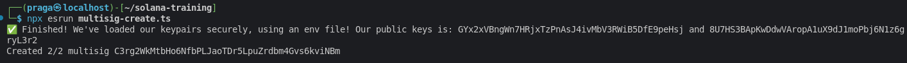
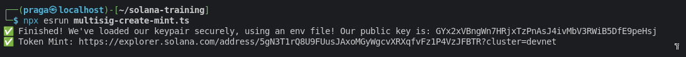
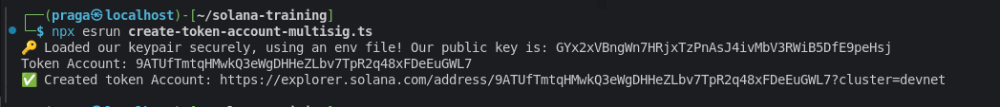
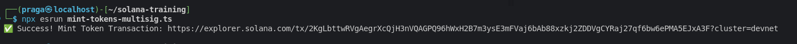
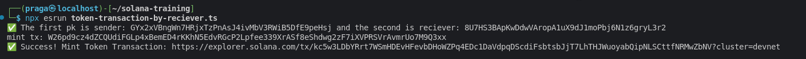
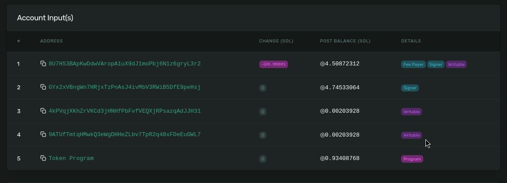

# Additional tasks for the fourth lab

## Multisig

**The result of the program `create-multisig`:**

 

**The result of the program `multisig-create-mint`:**

 

**The result of the program `multisig-create-token-account`:**

 

**The result of the program `multisig-mint-tokens`:**

 

## Token transfer, but in such a way that the recipient would pay SOL for the transaction

**The result of the transaction-by-recipient program:**

 

**fee, which was paid by the recipient in the transfer of the token**

 

